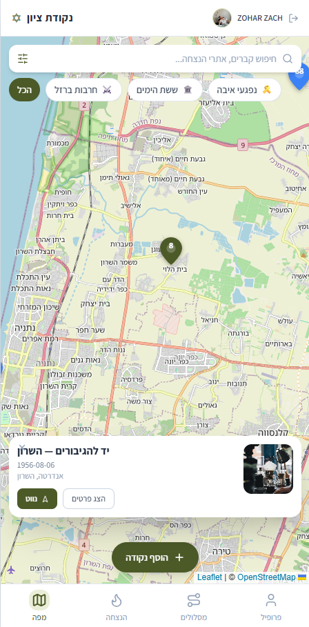
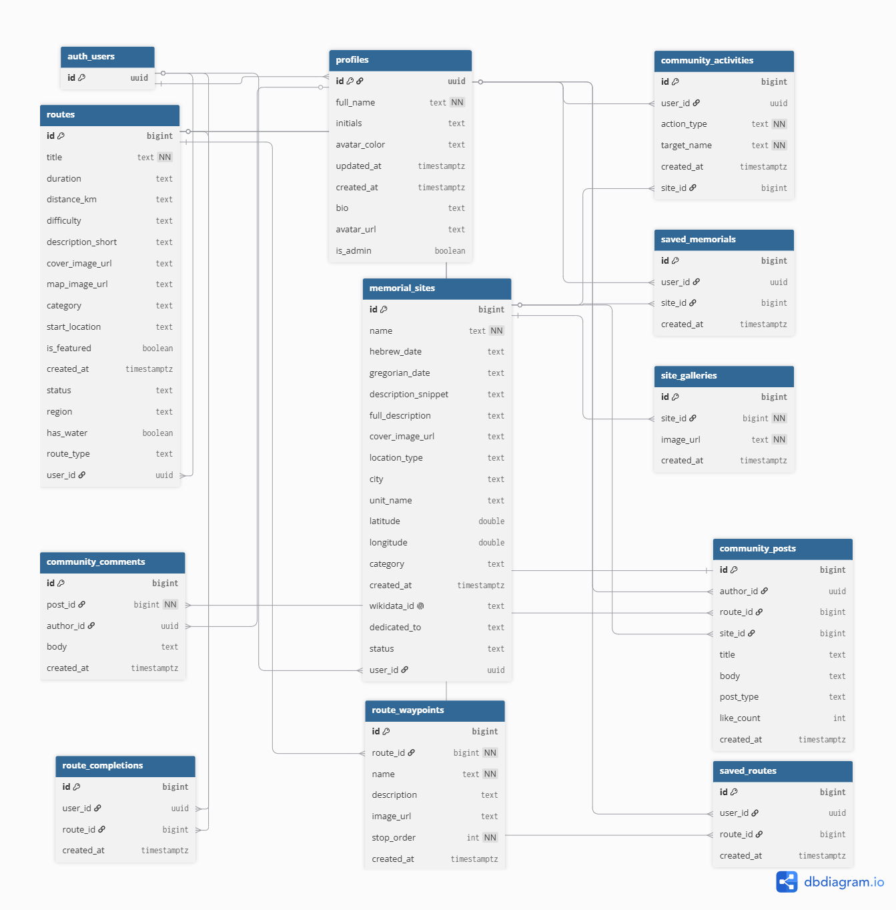

# 🕯️ Nekudat Tzion (נקודת ציון) — Memorial Map

> A location-based social platform for commemorating the fallen of Israel's wars and victims of hostile acts — turning remembrance from a static, one-way experience into a living, community-driven one.

**🔗 Live app:** **[https://memorial-map-murex.vercel.app/map](https://memorial-map-murex.vercel.app/map)**

> 📄 A Hebrew version of this document is available in **[README.he.md](./README.he.md)**.



*The interactive map view, showing memorial sites and heritage routes on a live map.*

---

## Table of Contents
1. [Overview](#overview)
2. [The Problem](#the-problem)
3. [Target Audience](#target-audience)
4. [Competitors & Differentiation](#competitors--differentiation)
5. [Key Features](#key-features)
6. [Tech Stack](#tech-stack)
7. [Architecture](#architecture)
8. [Data Model (ERD)](#data-model-erd)
9. [External Services & Integrations](#external-services--integrations)
10. [Security](#security)
11. [Local Development](#local-development)
12. [Testing](#testing)
13. [Deployment](#deployment)
14. [Project Structure](#project-structure)
15. [The Development Journey (Vibe Coding)](#the-development-journey-vibe-coding)

---

## Overview

**Nekudat Tzion** ("a point of reference / a landmark") is an interactive, location-based social platform built to preserve the legacy and stories of Israel's fallen soldiers and the victims of hostile acts. Instead of a static list, the app ties each human story to a physical point on a map, and adds community layers — lighting a virtual candle, a community activity feed, and user-contributed sites and stories — so that remembrance becomes active, shared, and alive.

The application is a **mobile-first, fully RTL (Hebrew) Progressive Web App**.

---

## The Problem

Israeli society experiences many tragic and formative events as a result of wars and hostile acts, and invests significant resources in commemorating the fallen. Despite this, **there is no single unified platform** for it. There is no dedicated social network where people can commemorate, share stories, give voice to grief, and encourage others to visit memorial sites and pay their respects. The information is scattered, gets lost, and lacks geographic context.

---

## Target Audience

| Audience | Need |
| --- | --- |
| **Bereaved families** | Preserving the personal story of their loved ones and making it accessible to the public. |
| **Hikers & travelers** | Connecting to the heritage and stories of the places they visit. |
| **General public & education system** | A meaningful, experiential, and active way to connect with national memory. |

---

## Competitors & Differentiation

| Competitor | Weakness |
| --- | --- |
| **The official "Yizkor" site** | Static, dated, and lacks community and location-based dimensions. |
| **Facebook / WhatsApp groups** | Information gets buried, is unorganized, and is not tied to physical navigation. |
| **Excel sheets & documents** | Fragmented, inaccessible, and non-experiential. |

### 🎯 Our differentiation
An interactive, location-based map combined with social components — **lighting a virtual candle, a community feed, and user-written stories** — that transform remembrance from a passive experience into an active, living, and shared one.

---

## Key Features

- 🗺️ **Interactive map** — memorial sites and heritage routes on a live map, with marker clustering, search, and an advanced filter sheet (by region and site type).
- ➕ **User-contributed content** — add new memorial points by pinning directly on the map, including stories and image uploads. Submissions are created as `pending` and surface after moderation.
- 🕯️ **Light a virtual candle** — a live, real-time candle counter per site (synced across users via Supabase Realtime).
- 👥 **Community feed** — a feed of community activity (candles lit, points added, routes completed).
- 🔐 **Auth & roles** — sign up / sign in, personal profile, "my submissions", and an Admin panel for content moderation.
- 🧭 **Heritage route navigation** — guided routes with waypoints and an active in-field navigation screen.
- 📱 **Production-ready UX** — loading skeletons, empty states, error states, a global error boundary, and an onboarding flow.

---

## Tech Stack

`React 18` · `Vite 5` · `React Router v6` · `Tailwind CSS 3` · `Leaflet` + `react-leaflet` + `react-leaflet-cluster` · `lucide-react` · `Supabase (PostgreSQL / Auth / Realtime / Storage)` · `Vitest` + `Testing Library` · `vite-plugin-pwa` · deployed on `Vercel` with CI via `GitHub Actions`.

---

## Architecture

**Frontend (React + Vite)** — a component-driven SPA. Global state lives in React Contexts:
- `AuthContext` — Supabase auth session + profile hydration (`isAdmin`, display name).
- `AppContext` — remote data (sites, routes), client-side filtering, candle counts + realtime sync, and per-user progress.
- `ToastContext` / `ConfirmContext` — app-wide toasts and confirm dialogs.

```
Frontend (React SPA)
        │
        ▼
Auth (Supabase Auth)  ──►  Profile hydration / RLS-gated reads
        │
        ▼
Database Layer (Supabase Postgres + RLS)
        │
        ▼
Geospatial Layer (Leaflet + OpenStreetMap tiles, marker clustering)
        │
        ▼
User interactions (create site, light candle, complete route)
```

**Backend (Supabase)** — a managed PostgreSQL database with Row Level Security, Supabase Auth (email/password), Realtime channels (live candle counts), and Storage (uploaded site images). All data access from the client goes through the auto-generated PostgREST API using the **public publishable (anon) key**, with RLS enforcing authorization.

**Data pipeline (offline tooling, `/scripts`)** — the dataset is generated by a self-contained synthetic seeding engine that composes authentic Hebrew prose (regions, wars, units, archetypes), and an algorithmic routing builder that uses the *Haversine* formula + a *Nearest-Neighbor* heuristic to generate heritage routes from site coordinates. These run offline at seed time, not in the client.

---

## Data Model (ERD)

The database is organized around memorial sites, the heritage routes that connect them, and the community/user layer.



**Core tables**

| Table | Purpose | Key relations |
| --- | --- | --- |
| `memorial_sites` | A commemorated location (name, dates, description, coordinates, `category`, `location_type`, `city`, `unit_name`, cover image). | 1‑to‑many → `site_galleries`; referenced by `community_activities`. |
| `routes` | A heritage route (title, length, region, type, metadata). | 1‑to‑many → `route_waypoints`. |
| `route_waypoints` | Ordered stops along a route. | many‑to‑1 → `routes`. |
| `site_galleries` | Additional images for a site. | many‑to‑1 → `memorial_sites`. |
| `profiles` | Public user profile (FK to `auth.users.id`), incl. `full_name`, `is_admin`. | 1‑to‑1 with `auth.users`; 1‑to‑many → `community_activities`. |
| `community_activities` | Activity feed entries (candles lit, sites added, routes completed). | many‑to‑1 → `profiles`, `memorial_sites`. |

**Relationships**
- `auth.users` → `profiles` (1‑to‑1)
- `profiles` → `memorial_sites` (1‑to‑many, contributions)
- `memorial_sites` → `site_galleries` (1‑to‑many)
- `routes` → `route_waypoints` (1‑to‑many)
- `profiles` / `memorial_sites` → `community_activities` (1‑to‑many)

### How to export the ERD from Supabase
There are two supported ways to produce the diagram:

1. **Supabase Schema Visualizer (recommended):**
   1. Open your project at **app.supabase.com**.
   2. Go to **Database → Schemas** (or **Table Editor**).
   3. Open the **Schema Visualizer** tab — it renders all tables, columns, and foreign-key relationships automatically.
   4. Use the export/download control (or take a high-resolution screenshot) and save it as `Photos/ERD.png`.

2. **From the SQL Editor (auto-layout via the visualizer):** run a query against `information_schema` / `pg_catalog` to confirm relationships, then use the visualizer above to render them. (The committed `Photos/ERD.png` was produced this way.)

> RLS policies and the helper RPCs are defined in [`scripts/schema_full_app.sql`](./scripts/schema_full_app.sql).

---

## External Services & Integrations

| Service | Type | Role in the project |
| --- | --- | --- |
| **Supabase** | Backend / DB / Auth / Realtime / Storage | PostgreSQL database, email/password auth, Row Level Security, live candle counts (Realtime), and image storage. |
| **Leaflet + OpenStreetMap** | Maps SDK / Tiles API | Interactive map rendering, OSM tiles, and location-based marker clustering (`leaflet.markercluster`). |
| **Google Maps** | External navigation (deep link) | Turn-by-turn navigation is launched via a Google Maps Directions deep link from a site's detail page. |
| **Browser Geolocation API** | Device API | "Locate me" — centers the map on the user's current position. |
| **Vercel** | Deployment / Hosting | Production hosting with SPA routing rewrites (`vercel.json`). |
| **GitHub Actions** | CI/CD | Runs the Vitest suite automatically on every push and PR to `main`. |

> **Note on auth:** authentication uses Supabase Auth (email/password) and can be extended to OAuth (e.g. Google) via Supabase's Providers infrastructure.

---

## Security

- **No secrets in client code.** The browser bundle only ever reads `VITE_SUPABASE_URL` and `VITE_SUPABASE_PUBLISHABLE_KEY`. The publishable (anon) key is *designed* to be public — it is meaningless without the Row Level Security policies that gate every read/write.
- **The service-role key is never bundled.** `SUPABASE_SERVICE_ROLE_KEY` is **not** `VITE_`-prefixed, so Vite never exposes it to the client; it is used only by offline Node seeding scripts.
- **`.env` is git-ignored and was never committed** to version control (verified against the full git history).
- **Row Level Security** is enforced on the database; policies (and helper RPCs) live in [`scripts/schema_full_app.sql`](./scripts/schema_full_app.sql). Anonymous reads are intentionally disabled — the app waits for an authenticated session before querying.
- **Route protection** on the client via `RequireAuth` / `RequireAdmin` guards.

---

## Local Development

```bash
# 1. Clone
git clone <repository-url>
cd MyProject

# 2. Install dependencies
npm install

# 3. Configure environment variables
# Create a .env file in the project root:
#   VITE_SUPABASE_URL=<your-supabase-url>
#   VITE_SUPABASE_PUBLISHABLE_KEY=<your-supabase-anon-key>
#   VITE_ADMIN_EMAIL=<email-to-treat-as-admin>   # optional

# 4. Run the dev server
npm run dev
```

The app will be available at `http://localhost:5173`.

| Command | Description |
| --- | --- |
| `npm run dev` | Start the Vite dev server. |
| `npm run build` | Build the production bundle. |
| `npm run preview` | Preview the production build locally. |
| `npm test` | Run the Vitest test suite. |

### Demo user
To explore the app without registering:

| | |
| --- | --- |
| **Email** | `galtenne225@gmail.com` |
| **Password** | `Tennec100` |

---

## Testing

Unit and integration tests run on **Vitest + Testing Library** (`tests/`), covering auth flows, confirm dialogs, service-layer CRUD, and storage. They execute automatically in CI on every push/PR to `main` via GitHub Actions.

```bash
npm test
```

---

## Deployment

- Hosted on **Vercel** with SPA rewrites configured in [`vercel.json`](./vercel.json) so client-side routes resolve correctly on hard refresh.
- The production console is kept clean (debug logging is disabled in production).
- A global **error boundary** ([`src/components/ErrorBoundary.jsx`](./src/components/ErrorBoundary.jsx)) prevents any component crash from producing a blank screen.

---

## Project Structure

```
src/
├── components/       # UI primitives (ui/), common widgets, ErrorBoundary, route guards
├── contexts/         # AuthContext, AppContext, ToastContext, ConfirmContext
├── hooks/            # useMemorial, useRoute, useChips, useActiveNavigation
├── pages/            # Map, Memorials, Routes, Profile, Admin, Auth, AddPoint, ...
├── services/         # Supabase data access (memorials, routes, community, saved, ...)
└── utils/            # supabase client
scripts/              # offline seeding + schema SQL (data pipeline)
tests/                # Vitest + Testing Library
```

---

## The Development Journey (Vibe Coding)

A short note on the process behind the scenes — and how I tried to take this project one step beyond the usual requirements of an academic assignment.

### 1. Building a real product, not just a prototype
It was important to me that the project wouldn't just "work on my machine," but would feel like a product that could ship to market tomorrow morning. Rather than simply pushing the code to Vercel and hoping for the best, I built a real development workflow: I added tests (with **Vitest**) and set up **CI/CD via GitHub Actions**. This way, every time I push new code, the system first runs the test suite to make sure nothing broke, and only then deploys the new version live. I also didn't compromise on data security — everything is protected at the database level with Supabase **Row Level Security (RLS)**, so no user can delete or edit anyone else's data.

### 2. A living map without manual data entry (smart use of AI)
One of the biggest challenges was making the map interesting and relevant from the very first moment. I didn't want to show new users an empty map, or type in meaningless placeholder data like "test 123." Instead, I built dedicated seeding scripts (`seed_direct_ai.js` and `seed_wikidata.js`) that use **large language models (LLMs)** — alongside data pulled from open sources such as Wikidata — to generate historical, respectful content about memorial sites and heritage routes. The script processed the data, applied location-clustering algorithms, and injected everything straight into the database. That's how I created dozens of memorial points and routes, from scratch, that look and feel completely real.

### 3. The development experience (Vibe Coding)
Throughout the project I didn't work alone — I used AI tools as a full-fledged "development team":

- **Backend & architecture:** I used the **Supabase AI Assistant** to validate that my data schemas were accurate, to phrase the complex security rules (RLS), and even to translate the data structure into the **ERD diagram** attached to this submission.
- **Complex logic:** With **Claude Code (CLI)** working alongside me directly in the terminal, I could tackle harder challenges quickly — for example, algorithms that compute geographic distances (the **Haversine formula**) to generate sensible routes from one memorial to the next.
- **Design & UI/UX:** The constant back-and-forth with the AI let me polish the **Tailwind** components, fix frustrating Hebrew (RTL) support bugs, and make sure the mobile user experience felt smooth and natural.

Ultimately, the Vibe Coding approach helped me not just write code faster, but focus on what truly matters — the architecture, the user experience, and building a project I'm genuinely proud of.

---

*Built as a final academic project — a React + Supabase + Leaflet Progressive Web App.*
